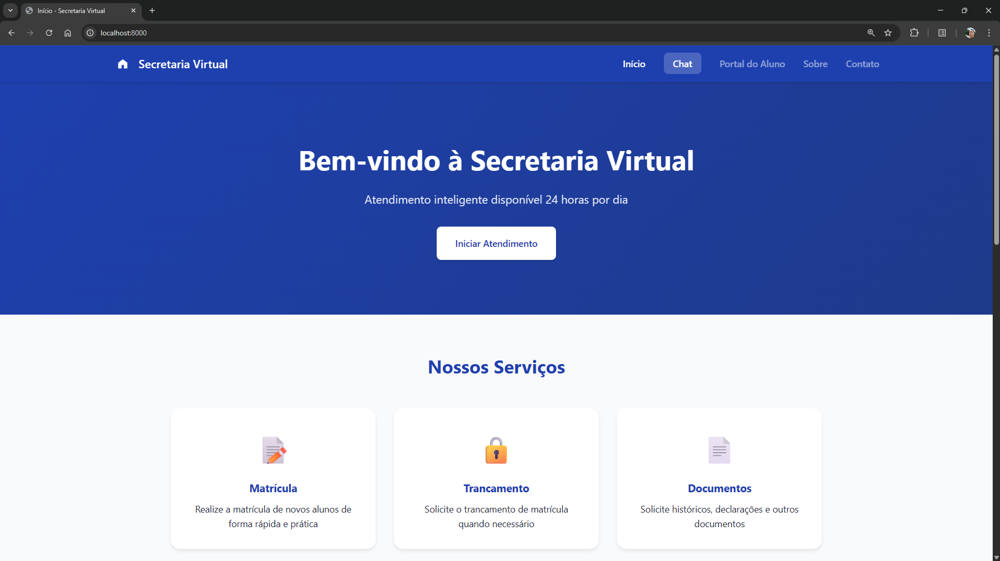
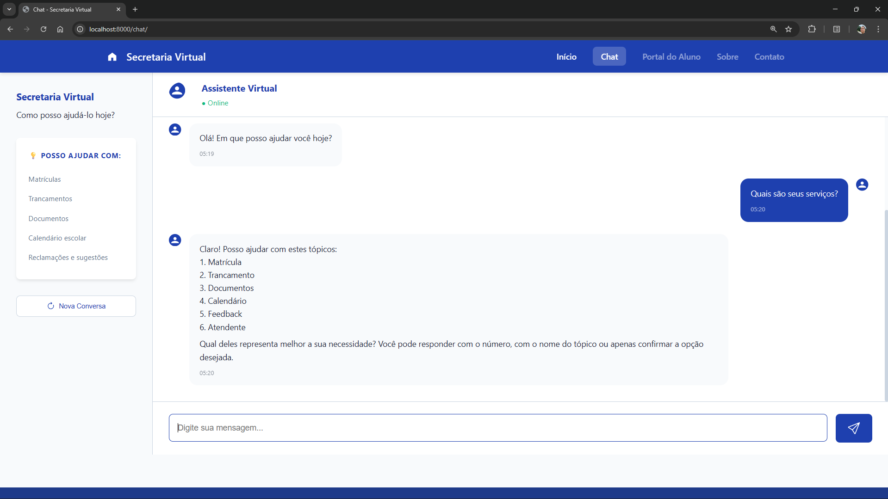

# Secretaria Virtual - Sistema de Atendimento Escolar

Sistema de atendimento automatizado para secretaria escolar usando Django e AtendentePro.

## 💡 Sobre o Projeto

Este projeto foi desenvolvido para demonstrar conhecimento prático em orquestração de agentes de IA usando AtendentePro.
Logo, seu foco está nos arquivos .yaml e no atendente_service.py

## 📸 Demonstração




## 🚀 Pré-requisitos

- Python 3.9+
- Chave de API da OpenAI ou Azure OpenAI
- Licença do AtendentePro (contato@monkai.com.br)

## 📦 Instalação

### 1. Clone o repositório
```bash
git clone https://github.com/LucasMAlc/atendentepro_project.git
cd atendentepro_project
```

### 2. Crie e ative o ambiente virtual
```bash
python -m venv venv

# Windows
venv\Scripts\activate

# Linux/Mac
source venv/bin/activate
```

### 3. Instale as dependências
```bash
pip install -r requirements.txt
```

### 4. Configure as variáveis de ambiente
```bash
# Copie o arquivo de exemplo
cp .env.example .env

# Edite o .env com suas credenciais
```

**Variáveis obrigatórias:**
```env
ATENDENTEPRO_LICENSE_KEY=ATP_seu-token-aqui
OPENAI_API_KEY=sk-sua-chave-openai
```

### 5. Execute as migrações
```bash
cd secretaria_virtual
python manage.py migrate
```

### 6. Inicie o servidor
```bash
python manage.py runserver
```

Acesse: http://localhost:8000

## 🐳 Docker (Opcional)

### Desenvolvimento
```bash
docker-compose up
```

Acesse: http://localhost:8000

### Produção
```bash
docker-compose -f docker-compose.prod.yml up -d
```

## 🔑 Obtendo as Chaves

### Licença AtendentePro
Entre em contato:
- 📧 Email: contato@monkai.com.br
- 🌐 Site: https://www.monkai.com.br

### Chave OpenAI
1. Acesse: https://platform.openai.com
2. Crie uma conta
3. Vá em API Keys
4. Adicione créditos
5. Copie sua chave `sk-...`

## 📁 Estrutura do Projeto

```
secretaria_virtual/
├── chat/                          
│   ├── atendente/
│   │   └── secretaria/           
│   │       ├── triage_config.yaml
│   │       ├── flow_config.yaml
│   │       ├── interview_config.yaml
│   │       ├── answer_config.yaml
│   │       ├── escalation_config.yaml
│   │       ├── feedback_config.yaml
│   │       ├── guardrails_config.yaml
│   │       └── knowledge_config.yaml
│   ├── services/
│   │   └── atendente_service.py  
│   ├── static/chat/
│   │   ├── css/style.css
│   │   └── js/chat.js
│   ├── templates/chat/
│   │   ├── base.html
│   │   ├── home.html
│   │   └── chat.html
│   ├── views.py
│   └── urls.py
└── manage.py
```

## 🎨 Personalização

### Modificar os YAMLs
Todos os YAMLs estão em `chat/atendente/secretaria/`:

- **triage_config.yaml** - Classifica intenção e direciona
- **flow_config.yaml** - Apresenta opções/menu ao usuário
- **interview_config.yaml** - Coleta informações através de perguntas
- **answer_config.yaml** - Sintetiza resposta final
- **escalation_config.yaml** - Canais de atendimento humano
- **feedback_config.yaml** - Sistema de tickets
- **guardrails_config.yaml** - Regras e limites
- **knowledge_config.yaml** - Consulta RAG e dados estruturados

### Modificar o Design
- **CSS**: `chat/static/chat/css/style.css`
- **JavaScript**: `chat/static/chat/js/chat.js`
- **Templates**: `chat/templates/chat/`


## 📚 Documentação Adicional

- [AtendentePro](https://pypi.org/project/atendentepro/)
- [OpenAI API](https://platform.openai.com/docs)
- [Django](https://docs.djangoproject.com/)

**Dúvidas sobre o projeto:**
- Abra uma issue no repositório

## Licença

Este projeto é para fins educacionais e demonstrativos.

**Feito usando Django + AtendentePro**
